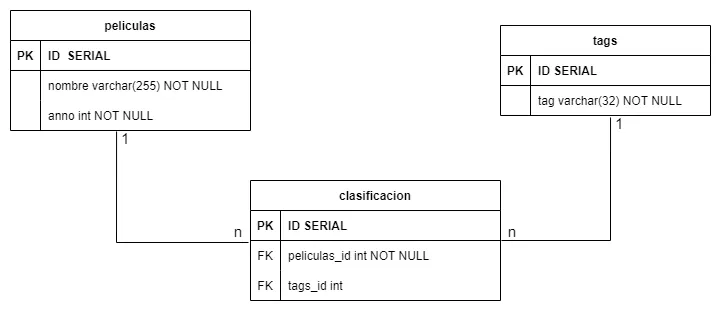
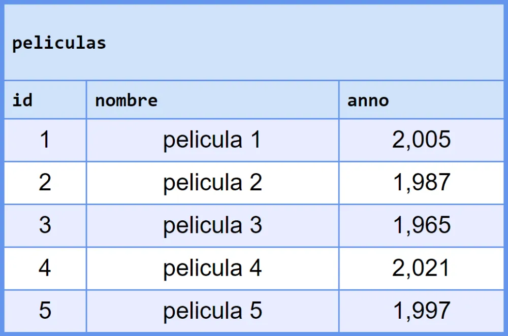
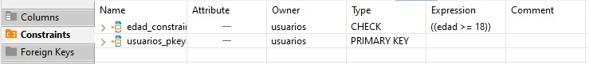

# Desarrollo Prueba Módulo 5: Fundamentos de bases de datos relacionales

El presente repositorio contiene el código utilizado para resolver la prueba con la que se finaliza el módulo 5 **Fundamentos de bases de datos relaciones** de la beca **Desarrollo de aplicaciones Full Stack Javascript Trainee** dictada por Desafío Latam.

Los requisitos de la prueba son los siguientes:


He grabado el video el cual esta disponible en el siguiente [link](https://vimeo.com/922130771).

A continuación muestro un preview del video el cual es un gif con los primeros 30 segundos. Al hacer click en la imagen, se redirecciona al video que he alojado en la plataforma Vimeo:

[](https://vimeo.com/922130771)

El desarrollo de cada pregunta se encuentra en los siguientes minutos y segundos:

-Pregunta 1: 00:31

-Pregunta 2: 01:25

-Pregunta 3: 02:19

-Pregunta 4: 02:41

-Pregunta 5: 04:01

-Pregunta 6: 04:54

-Pregunta 7: 05:20

-Pregunta 8: 05:44

-Pregunta 9: 06:34

-Pregunta 10: 07:07

Ahora procedo a explicar cada una de mis soluciones a cada pregunta:

## 1. Crea el modelo (revisa bien cuál es el tipo de relación antes de crearlo), respeta las claves primarias, foráneas y tipos de datos

He utilizado **DBeaver** versión **24.0.0** para crear una base de datos llamada **Modelo1** en la cual trabajaré las tres primeras preguntas que corresponden al modelo físico siguiente:



En dicho modelo he creado una tabla intermedia llamada **clasificacion** de modo tal de modelar la relación de muchos es a muchos vía claves foráneas a las tablas **peliculas** y **tags**.

En la primera pregunta me piden crear el modelo físico para lo cual he utilizado el siguiente código:

```sql
CREATE TABLE
    peliculas (
        id serial PRIMARY KEY,
        nombre VARCHAR(255) NOT NULL,
        anno INT NOT NULL
    );

CREATE TABLE
    tags (
        id serial PRIMARY KEY,
        tag VARCHAR(32) NOT NULL
    );

CREATE TABLE
    clasificacion (
        id serial PRIMARY KEY,
        peliculas_id INT NOT NULL,
        tags_id INT,
        CONSTRAINT fk_peliculas_id FOREIGN KEY (peliculas_id) REFERENCES peliculas (id),
        CONSTRAINT fk_tags_id FOREIGN KEY (tags_id) REFERENCES tags (id)
    );
```

## 2. Inserta 5 películas y 5 tags, la primera película tiene que tener 3 tags asociados, la segunda película debe tener dos tags asociados

He creado el siguiente código que realiza lo pedido:

```sql
INSERT INTO
    peliculas (nombre, anno)
VALUES
    (
        'pelicula 1',
        2005
    ),
    (
        'pelicula 2',
        1987
    ),
    (
        'pelicula 3',
        1965
    ),
    (
        'pelicula 4',
        2021
    ),
    (
        'pelicula 5',
        1997
    );

INSERT INTO
    tags (tag)
VALUES
    ('acción'),
    ('drama'),
    ('aventura'),
    ('romance'),
    ('thriller');

INSERT INTO
    clasificacion (
        peliculas_id,
        tags_id
    )
VALUES
    (1, 1),
    (1, 3),
    (1, 5),
    (2, 2),
    (2, 4),
    (3, 1),
    (4, NULL),
    (5, NULL);

```

Dicho código crea 5 peliculas, 5 tags y la pelicula 1 posee 3 tags, la pelicula 2 posee 2 tags, la pelicula 3 posee 1 tag y la pelicula 4 y 5 poseen 0 tag(valor nulo).

Las tablas pobladas las muestro a continuación:




## 3. Cuenta la cantidad de tags que tiene cada película. Si una película no tiene tags debe mostrar 0

He creado el siguiente código que resuelve lo anterior:

```sql
SELECT
    peliculas_id,
    COUNT(tags_id)
FROM
    clasificacion
GROUP BY
    peliculas_id
ORDER BY
    COUNT(tags_id) DESC;
```

Utilizo la función count la cual no considera los valores nulos, es decir, no los agrega a la cuenta. De este modo las películas que no tienen tags asociados son contadas con 0 tag.

El resultado de dicha consulta es el siguiente:


## 4. Crea las tablas respetando los nombres, tipos, claves primarias y foráneas y tipos de datos

Para resolver esta pregunta y el resto de preguntas, creo la base de datos llamada **Modelo2**. Una vez creada procedo a crear el modelo físico utilizando el siguiente código:

```sql
CREATE TABLE
    preguntas (
        id serial PRIMARY KEY,
        pregunta VARCHAR(255),
        respuesta_correcta VARCHAR
    );

CREATE TABLE
    usuarios (
        id serial PRIMARY KEY,
        nombre VARCHAR(255),
        edad INTEGER
    );

CREATE TABLE
    respuestas (
        id serial PRIMARY KEY,
        respuesta VARCHAR(255),
        usuario_id INTEGER,
        pregunta_id INTEGER,
        CONSTRAINT fk_usuario_id FOREIGN KEY (usuario_id) REFERENCES usuarios (id),
        CONSTRAINT fk_pregunta_id FOREIGN KEY (pregunta_id) REFERENCES preguntas (id)
    );
```

## 5. Agrega datos, 5 usuarios y 5 preguntas, la primera pregunta debe estar contestada dos veces correctamente por distintos usuarios, la pregunta 2 debe estar contestada correctamente sólo por un usuario, y las otras 2 respuestas deben estar incorrectas

a. Contestada correctamente significa que la respuesta indicada en la tabla
respuestas es exactamente igual al texto indicado en la tabla de preguntas.

Para realizar lo pedido he escrito el siguiente código:

```sql
INSERT INTO
    usuarios (nombre, edad)
VALUES
    (
        'usuario_1',
        15
    ),
    (
        'usuario_2',
        35
    ),
    (
        'usuario_3',
        55
    ),
    (
        'usuario_4',
        47
    ),
    (
        'usuario_5',
        22
    );

INSERT INTO
    preguntas (
        pregunta,
        respuesta_correcta
    )
VALUES
    (
        'pregunta_1',
        'respuesta_correcta_pregunta_1'
    ),
    (
        'pregunta_2',
        'respuesta_correcta_pregunta_2'
    ),
    (
        'pregunta_3',
        'respuesta_correcta_pregunta_3'
    ),
    (
        'pregunta_4',
        'respuesta_correcta_pregunta_4'
    ),
    (
        'pregunta_5',
        'respuesta_correcta_pregunta_5'
    );


INSERT INTO
    respuestas (
        respuesta,
        usuario_id,
        pregunta_id
    )
VALUES
    (
        'respuesta_correcta_pregunta_1',
        1,
        1
    ),
    (
        'respuesta_correcta_pregunta_1',
        2,
        1
    ),
    (
        'respuesta_incorrecta_pregunta_1',
        3,
        1
    ),
    (
        'respuesta_incorrecta_pregunta_1',
        4,
        1
    ),
    (
        'respuesta_incorrecta_pregunta_1',
        5,
        1
    ),
    (
        'respuesta_incorrecta_pregunta_2',
        1,
        2
    ),
    (
        'respuesta_incorrecta_pregunta_2',
        2,
        2
    ),
    (
        'respuesta_correcta_pregunta_2',
        3,
        2
    ),
    (
        'respuesta_incorrecta_pregunta_2',
        4,
        2
    ),
    (
        'respuesta_incorrecta_pregunta_2',
        5,
        2
    ),
    (
        'respuesta_correcta_pregunta_3',
        1,
        3
    ),
    (
        'respuesta_incorrecta_pregunta_3',
        2,
        3
    ),
    (
        'respuesta_correcta_pregunta_3',
        3,
        3
    ),
    (
        'respuesta_incorrecta_pregunta_3',
        4,
        3
    ),
    (
        'respuesta_incorrecta_pregunta_3',
        5,
        3
    ),
    (
        'respuesta_correcta_pregunta_4',
        1,
        4
    ),
    (
        'respuesta_correcta_pregunta_4',
        2,
        4
    ),
    (
        'respuesta_incorrecta_pregunta_4',
        3,
        4
    ),
    (
        'respuesta_incorrecta_pregunta_4',
        4,
        4
    ),
    (
        'respuesta_correcta_pregunta_4',
        5,
        4
    ),
    (
        'respuesta_correcta_pregunta_5',
        1,
        5
    ),
    (
        'respuesta_correcta_pregunta_5',
        2,
        5
    ),
    (
        'respuesta_correcta_pregunta_5',
        3,
        5
    ),
    (
        'respuesta_correcta_pregunta_5',
        4,
        5
    ),
    (
        'respuesta_correcta_pregunta_5',
        5,
        5
    );
```

La data de la tabla **respuestas** la he creado en base al siguiente diagrama:

```sql
/*
inserto data siguiendo la siguiente tabla
_________usuario1 usuario2 usuario3 usuario4 usuario5
pregunta1----y--------y--------n--------n--------n----
pregunta2----n--------n--------y--------n--------n----
pregunta3----y--------n--------y--------n--------n----
pregunta4----y--------y--------n--------n--------y----
pregunta5----y--------y--------y--------y--------y----
 */
```

Donde **y** significa que la pregunta fue contestada correctamente y **n** significa que la pregunta fue contestada de manera incorrecta.

## 6. Cuenta la cantidad de respuestas correctas totales por usuario (independiente de la pregunta)

He creado la siguiente consulta:

```sql
SELECT
    cruce.id,
    cruce.nombre,
    SUM(
        cruce.resultado
    ) cuenta_correctas
FROM
    (
        SELECT
            u.id,
            u.nombre,
            CASE
                WHEN p.respuesta_correcta = r.respuesta THEN 1
                ELSE 0
            END AS resultado
        FROM
            preguntas AS p
            INNER JOIN respuestas AS r ON r.pregunta_id = p.id
            INNER JOIN usuarios AS u ON r.usuario_id = u.id
    ) cruce
GROUP BY
    cruce.id,
    cruce.nombre
ORDER BY
    cruce.id;
```

En dicho código creo una tabla en una subconsulta con una columna auxiliar de nombre **resultado** que almacena un 1 cuando la respuesta contestada es igual a la respuesta almacenada de manera correcta y registra un 0 en caso contrario. Luego procedo a consultar la tabla que tiene dicha columna auxiliar y realizo una agrupación por id y nombre de la pelicula de modo tal de sumar los valores 1 que corresponden a respuesta certera, cuando no existe una respuesta correcta el valor es cero y su valor no es agregado a la suma total.

El resultado de dicha consulta es el siguiente:


## 7. Por cada pregunta, en la tabla preguntas, cuenta cuántos usuarios tuvieron la respuesta correcta

El código que responde dicha pregunta es el siguiente:

```sql
SELECT
    cruce.pregunta,
    SUM(
        cruce.resultado
    ) cantidad_respuesta_correcta
FROM
    (
        SELECT
            p.pregunta,
            r.usuario_id,
            CASE
                WHEN p.respuesta_correcta = r.respuesta THEN 1
                ELSE 0
            END AS resultado
        FROM
            preguntas AS p
            INNER JOIN respuestas AS r ON r.pregunta_id = p.id
    ) cruce
GROUP BY
    cruce.pregunta
ORDER BY
    cruce.pregunta;

```

En dicho código creo una tabla auxiliar en la subconsulta la cual posee una columna auxiliar que establece en 1 cuando la respuesta a la pregunta es igual a la respuesta almacenada de manera correcta para dicha pregunta y establece un 0 en caso contrario. Luego procedo a agrupar por pregunta la suma de la columna resultado que corresponderá a la cantidad de respuestas correctas.

El resultado de dicha consulta es el siguiente:


## 8. Implementa borrado en cascada de las respuestas al borrar un usuario y borrar el primer usuario para probar la implementación

En primer lugar borro la foreign key establecida sobre la columna **usuario_id** de la tabla **respuestas** y procedo a crear una nueva foreign key sobre la misma columna **usuario_id** pero ahora con el agregado **ON DELETE CASCADE** el cual realiza la eliminación en cascada sobre la tabla **respuestas** al borrar registros en la tabla **usuarios**:

```sql
ALTER TABLE respuestas
DROP CONSTRAINT fk_usuario_id;

ALTER TABLE respuestas
ADD CONSTRAINT fk_usuario_id
FOREIGN KEY (usuario_id)
REFERENCES usuarios (id) ON DELETE CASCADE;
```

Posteriormente, procedo a eliminar de la tabla **usuarios** el primer registro y verificar que todos los registros enlazados en la tabla **respuestas** son borrados:

```sql
DELETE FROM usuarios
WHERE
    id = 1;
```

Previa eliminación la data en la tabla **respuestas** es la siguiente:


Post eliminación la data en la tabla **respuestas** es la siguiente:


## 9. Crea una restricción que impida insertar usuarios menores de 18 años en la base de datos

He creado la siguiente restricción:

```sql
ALTER TABLE usuarios
ADD CONSTRAINT edad_constraint CHECK (edad >= 18);
```

Dicha restricción impide insertar registros con edad menor a 18 años en la tabla **usuarios**.

Previa añadidura de dicha restricción, las restricciones de la tabla **usuarios** son las siguientes:


Post añadidura de dicha restricción, las restricciones de la tabla **usuarios** son las siguientes:



Si deseo insertar un registro con edad igual a 5 años se me impide debido a la restricción de edad:

```sql
INSERT INTO
usuarios (nombre, edad)
VALUES
('1', 5);
```


## 10. Altera la tabla existente de usuarios agregando el campo email con la restricción de único

Procedo a alterar la tabla **usuarios** agregando una columna llamada **email** con la restricción de solo permitir el ingreso de valor únicos:

```sql
ALTER TABLE usuarios
ADD COLUMN email VARCHAR UNIQUE;
```

Previa añadidura de la columna **email** las restricciones de la tabla **usuarios** son las siguientes:


Post añadidura de la columna **email** las restricciones de la tabla **usuarios** son las siguientes:


Procedo a insertar un registro con email en la tabla usuarios:

```sql
INSERT INTO
usuarios (
nombre,
edad,
email
)
VALUES
(
'waldo',
33,
'abc@mail.com'
);
```

Luego intento insertar otro registro con el mismo email:

```sql
INSERT INTO
usuarios (
nombre,
edad,
email
)
VALUES
(
'maria',
22,
'abc@mail.com'
);
```

La inserción del registro anterior falla debido a que posee el mismo email igual a **abc@mail.com**:


